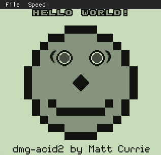
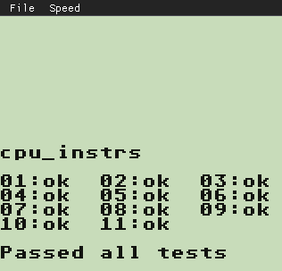
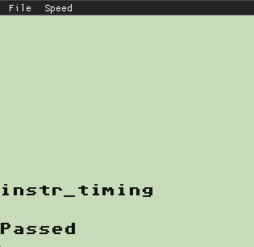

# gbEmulator
Game Boy (DMG) emulator written in C++.

https://github.com/user-attachments/assets/5637903a-0fda-4e8e-ac43-b969f2a94824

<table>
  <tr>
    <td></td>
    <td></td>
    <td></td>
  </tr>
  <tr>
    <td></td>
    <td></td>
    <td></td>
  </tr>
</table>

## Features
<ul>
  <li> CPU emulation (Sharp LR35902)</li>
  <li> M-cycle accuracy </li>
  <li> Pixel FIFO </li>
  <li> MBC1, MBC3 (including Real Time Clock), and MBC5 support</li>
  <li> Save states – save and load game progress at any point.</li>
  <li> Fast forwarding </li>
</ul>

## Building the Project

Make sure you have the latest version of CMake installed.

Clone the repository
```
git clone https://github.com/vitorlz/gbEmulator.git
```
### On Windows:
From the directory containing CMakeLists.txt:
```
mkdir build
cd build
cmake ..
cmake --build . --config Release
```
From the build directory:
```
cd Release
cp -r ../res .
./gbEmulator
```
### On macOS/Linux:
From the directory containing CMakeLists.txt
```
mkdir build && cd build
cmake ..
cmake --build . --config Release
```
From the build directory
```
./gbEmulator
```
## How to Play

1. Click **File** → **Load ROM...**  
   - Select a ROM file from your computer using the file explorer.  
2. *(Optional)* If you have a save file, load it by clicking **File** → **Load Save File...**  
   - *Note: This can only be done after loading a ROM.*  

### Saving Your Progress  

- **Quick Save:** Click **Save** to create a save file in the same directory as your ROM.  
  - The save file will have the same name as your ROM, with `_save` appended.  
  - **Example:** If your ROM file is `pokemon.gb`, the save file will be `pokemon.gb_save`.  
- **Save As...:** Click **File** → **Save As...** to manually choose a name and location for your save file.  
- If you previously **quick saved**, the emulator will automatically load the save file the next time you open the same ROM (*as long as the file name and path remain unchanged*).  

## Commands
| Button  | Key       |
|---------|----------|
| **A**   | X        |
| **B**   | Z        |
| **Up**  | ↑ (Up Arrow) |
| **Down**| ↓ (Down Arrow) |
| **Left**| ← (Left Arrow) |
| **Right**| → (Right Arrow) |
| **Start**| Enter   |
| **Select**| Backspace |

## Tests

<table>
  <tr>
    <td></td>
    <td></td>
    <td></td>
  </tr>
</table>


