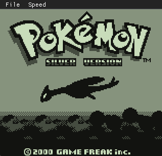
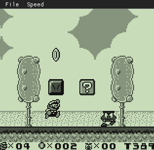
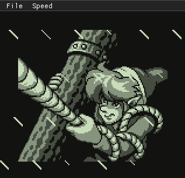
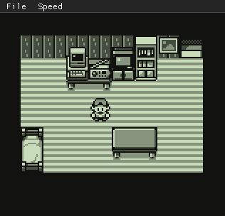
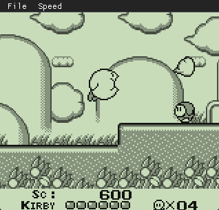
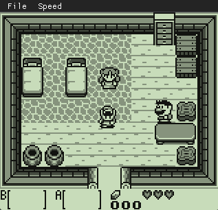

# gbEmulator
Game Boy (DMG) emulator written in C++.


https://github.com/user-attachments/assets/5637903a-0fda-4e8e-ac43-b969f2a94824

<table>
  <tr>
    <td></td>
    <td></td>
    <td></td>
  </tr>
  <tr>
    <td></td>
    <td></td>
    <td></td>
  </tr>
</table>

## Building the Project

Make sure you have the latest version of CMake installed.

Clone the repository
```
git clone https://github.com/vitorlz/gbEmulator.git
```
### On Windows:
```
mkdir build
cd build
cmake ..
cmake --build . --config Release
```
to run:
```
cd Release
cp -r ../res .
./gbEmulator
```
### On macOS/Linux:
```
mkdir build && cd build
cmake ..
cmake --build . --config Release
```
to run:
```
cd build
./gbEmulator
```


